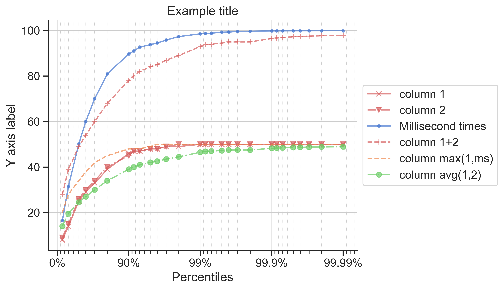
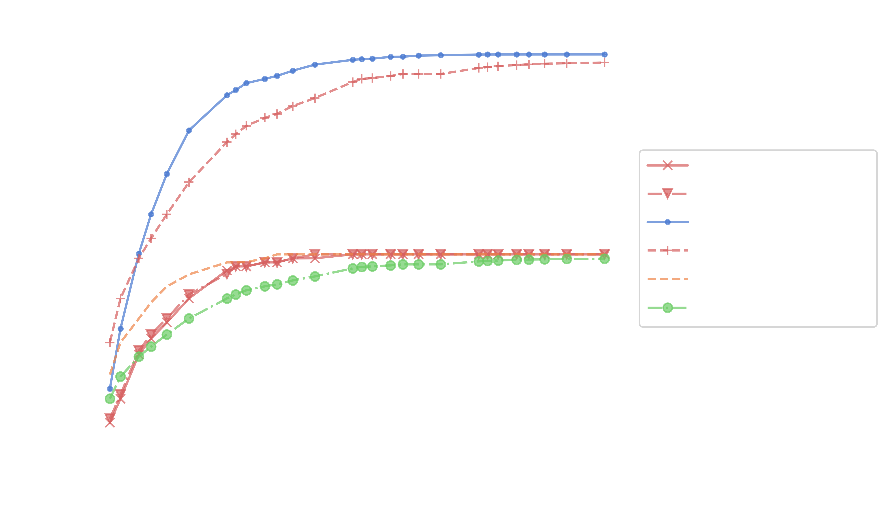

# prettypercentiles

Python utility for pretty percentile plots. Ideal for plotting latency graphs.

## Usage

Install Python 3 (Tested so far with 3.9)

(Optional but recommended to prevent cluttering your global pip) create a virtual environment in this directory:

```
python -m venv .venv
```

Activate the virtual environment:

```
.venv\Scripts\activate
```

Install dependencies from `requirements.txt`:

```
pip install -r requirements.txt
```

Run plotter:

```
python prettypercentiles.py -c configs.example_config
```

## Output

Running example config:

```
python prettypercentiles.py -c configs.example_config
```

the above command results in the following image in `images/example_plot.png`:



Dark mode config (white text and grid lines):

```
python prettypercentiles.py -c configs.example_config_dark
```

output image in `images/example_plot_dark.png`:


